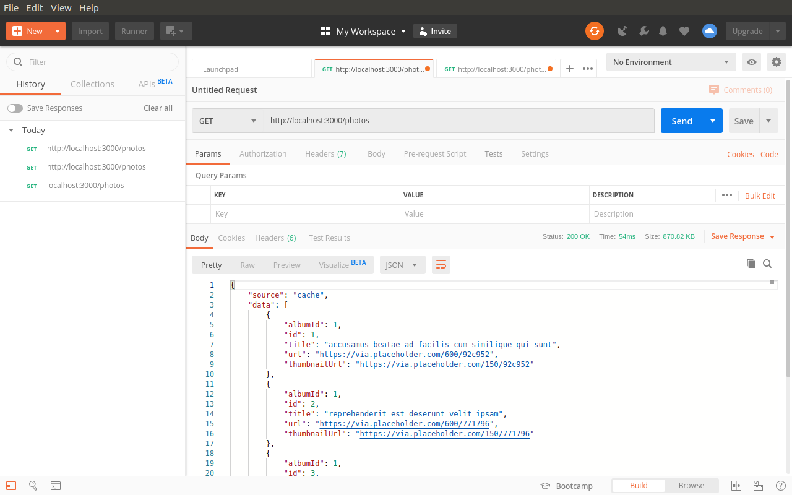

# Redis Cache

Laboratorio Redis para mejorar el manejo de memoria cache.

## Fuente del laboratorio

La fuente de consulta de este laporatorio esta en este [link](https://medium.com/tech-tajawal/introduction-to-caching-redis-node-js-e477eb969eab)

## Resultado

En las siguientes imagenes se encuentra la comparacion de velocidad al manejar la memoria cache.

